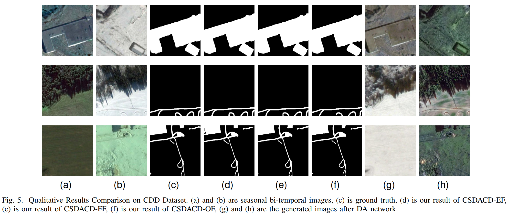

# CSDACD: Domain-adaptive Change Detection Network for Cross-seasonal Remote Sensing Images

The source code for CSDACD: Domain-adaptive Change Detection Network for Cross-seasonal Remote Sensing Images. For more details, please refer to our paper 

# Abstract

Change detection (CD) is a crucial task in earth remote sensing, and it plays a significant role in analyzing changes in a region. However, bi-temporal images acquisition may cause domain shift problems due to the seasonal difference. Most cross-seasonal change detection methods currently in use make it difficult to capture the impact of domain shift. In contrast, domain adaptation (DA) methods struggle with fuzzy semantic correspondence and suboptimal use of generated data, which leads to incomplete target images. To address these problems, we propose CSDACD, an end-to-end domain-adaptive change detection network that integrates domain-adaptive images into the CD network. Additionally, we introduce the Semantic Change Alignment (SCA) module to include the registration and semantic change information of bi-temporal images and design three data fusion modules to enhance the adaptability of DA and CD networks. Our experiments show that CSDACD outperforms the state-of-the-art (SOTA) methods in cross-seasonal change detection tasks, achieving an F1-score of 98.73% and IoU of 97.49% in the CDD dataset.  


# Prerequisites

```bash
conda env create -f environment.yml -n csdacd
conda activate csdacd
```

# Get Started

Change the dataset locations to your own in `src/constants.py`.

# Model Training

Start training using the following command

```bash
cd src
python train.py train --exp_config PATH_CONFIG_FILE 
```

For example, if you want to train the `CSDACD_OF` model with `CDD` dataset, use

```bash
cd src
python train.py train --exp_config ../configs/cdd/config_cdd_csdacd_of.yaml
```

The CSDACD is built based on CDLab Framework, for more model training details, please refer to https://github.com/Bobholamovic/CDLab.

# Model Evaluation

Use the following command to evaluate a model on the test subset

```bash
cd src
python train.py eval --exp_config PATH_TO_CONFIG_FILE --resume PATH_TO_CD_MODEL_CHECKPOINT --resume_G_SW PATH_TO_G_SW_MODEL_CHECKPOINT --resume_G_WS PATH_TO_G_WS_MODEL_CHECKPOINT --save_on --subset test
```

For example, if you want to evaluate the `CSDACD_OF` model with `CDD` dataset, use

```bash
cd src
python train.py eval --exp_config ../configs/cdd/config_cdd_csdacd_of.yaml --resume ../weights/cdd_of/CD_model_best_csdacd_of.pth --resume_G_SW ../weights/cdd_of/G_SW_model_best_csdacd_of.pth --resume_G_WS ../weights/cdd_of/G_WS_model_best_csdacd_of.pth --save_on --subset test
```

You can also use the following command to infer a single pair of images

```bash
cd src
python sw_test.py --exp_config PATH_TO_CONFIG_FILE --ckp_path PATH_TO_CD_MODEL_CHECKPOINT --ckp_path_G_SW PATH_TO_G_SW_MODEL_CHECKPOINT --ckp_path_G_WS PATH_TO_G_WS_MODEL_CHECKPOINT --t1_dir PATH_TO_T1_DIR --t2_dir PATH_TO_T2_DIR --gt_dir PATH_TO_GT_DIR
```

We have also prepared a pair of demo images for you to use for model inference, use

```bash
cd src
python sw_test.py --exp_config ../configs/cdd/config_cdd_csdacd_of.yaml --ckp_path ../weights/cdd_of/CD_model_best_csdacd_of.pth --ckp_path_G_SW ../weights/cdd_of/G_SW_model_best_csdacd_of.pth --ckp_path_G_WS ../weights/cdd_of/G_WS_model_best_csdacd_of.pth --t1_dir ../demo/summer.jpg --t2_dir ../demo/winter.jpg --gt_dir ../demo/label.jpg
```

The CSDACD is built based on CDLab Framework, for more model evaluation details, please refer to https://github.com/Bobholamovic/CDLab.

# DataSets

We provide preprocessed datasets that you can download from `Link` and place in the `src/data` folder. You can also find the original dataset in the `Source` and preprocess it yourself.

| Dataset |                             Link                             |                            Source                            |
| :-----: | :----------------------------------------------------------: | :----------------------------------------------------------: |
|   CDD   | [BaiduNetdisk (Extraction code: ljba)](https://pan.baidu.com/s/1ufX4uRb4XKgrAwf8pbN97g) | [CDD source](https://drive.google.com/file/d/1GX656JqqOyBi_Ef0w65kDGVto-nHrNs9/edit) |
|   WHU   | [BaiduNetdisk (Extraction code: wdoe)](https://pan.baidu.com/s/1W-ftHiiDHtft073HXWYNUw) | [WHU source](https://study.rsgis.whu.edu.cn/pages/download/building_dataset.html) |

# Weights

We provide pretrained models for three different model structures (EF、FF and OF) on the CDD and WHU datasets. You can download it through the following `Link` and place it in the `weights` folder for model inference.

### CDD DataSet

|   Model   |                             Link                             |
| :-------: | :----------------------------------------------------------: |
| CSDACD_EF | [BaiduNetdisk (Extraction code: w8b8)](https://pan.baidu.com/s/1keEMc_BeZYsq33qsDQg61Q) |
| CSDACD_FF | [BaiduNetdisk (Extraction code: lsv9)](https://pan.baidu.com/s/1ybyttbnS25H4y8D9bNAb-A) |
| CSDACD_OF | [BaiduNetdisk (Extraction code: rvbq)](https://pan.baidu.com/s/1sQFTAQlXcPtUIYJVD44WWg) |

### WHU Dataset

|   Model   |                             Link                             |
| :-------: | :----------------------------------------------------------: |
| CSDACD_EF | [BaiduNetdisk (Extraction code: eib6)](https://pan.baidu.com/s/1oFDa3Lo1tGoUf5YZep9amQ) |
| CSDACD_FF |                                                              |
| CSDACD_OF | [BaiduNetdisk (Extraction code: i3jh)](https://pan.baidu.com/s/1c35-u8VNW7uSk9mTyl1RyQ) |

# Results

Here are the qualitative and quantitative results of our proposed model and baseline method on the CDD and WHU datasets.

## Qualitative Results

### CDD Dataset



### WHU Dataset


## Quantitative Results

### CDD Dataset

|  Method   |   P(%)    |   R(%)    |   F1(%)   |  IoU(%)   | Params(M) |
| :-------: | :-------: | :-------: | :-------: | :-------: | :-------: |
| CSDACD-EF |   98.79   |   98.54   |   98.66   |   97.36   |   28.18   |
| CSDACD-FF |   98.79   | **98.66** |   98.72   |   97.48   |   31.30   |
| CSDACD-OF | **98.85** |   98.61   | **98.73** | **97.49** |   34.62   |

### WHU Dataset

|  Method   | P(%)  | R(%)  | F1(%) | IoU(%) | Params(M) |
| :-------: | :---: | :---: | :---: | :----: | :-------: |
| CSDACD-EF | 93.24 | 90.01 | 91.60 | 84.50  |   28.18   |
| CSDACD-FF |       |       |       |        |           |
| CSDACD-OF | 94.02 | 91.15 | 92.56 | 86.15  |   34.62   |

# Acknowledgements

- [CDLab](https://github.com/Bobholamovic/CDLab)
- [SDACD](https://github.com/Perfect-You/SDACD)
- [CDD dataset](https://drive.google.com/file/d/1GX656JqqOyBi_Ef0w65kDGVto-nHrNs9/edit)
- [WHU dataset](https://study.rsgis.whu.edu.cn/pages/download/building_dataset.html)

# Citation

If you find this project helpful for your research, please consider citing the following BibTeX entry.

```latex
@article{linTransitionProcessPairtoVideo2023,
  title = {Transition {{Is}} a {{Process}}: {{Pair-to-Video Change Detection Networks}} for {{Very High Resolution Remote Sensing Images}}},
  shorttitle = {Transition {{Is}} a {{Process}}},
  author = {Lin, Manhui and Yang, Guangyi and Zhang, Hongyan},
  year = {2023},
  journal = {IEEE Trans. Image Process.},
  volume = {32},
  pages = {57--71},
  issn = {1057-7149, 1941-0042},
  doi = {10.1109/TIP.2022.3226418},
  urldate = {2023-07-11},
  langid = {english}
}

@article{liuEndtoendSupervisedDomain2022,
  title = {An {{End-to-end Supervised Domain Adaptation Framework}} for {{Cross-Domain Change Detection}}},
  author = {Liu, Jia and Xuan, Wenjie and Gan, Yuhang and Zhan, Yibing and Liu, Juhua and Du, Bo},
  year = {2022},
  month = dec,
  journal = {Pattern Recogn.},
  volume = {132},
  pages = {108960},
  issn = {00313203},
  doi = {10.1016/j.patcog.2022.108960},
  urldate = {2023-07-06},
  langid = {english}
}


```

